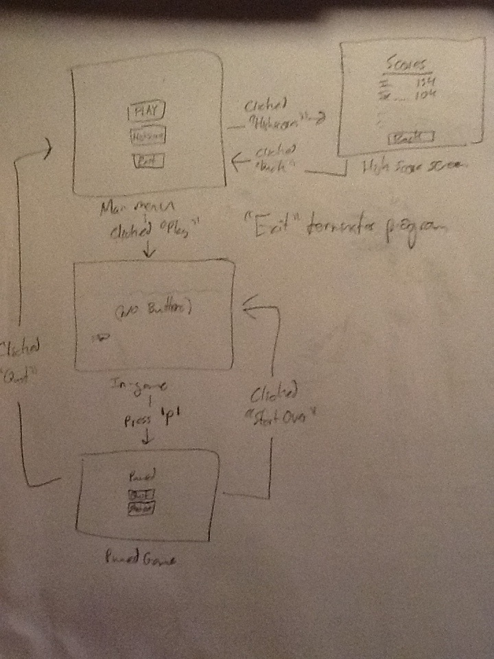

The player plays as a cuttlefish going to save his girlfriend from a chinese 
restaurant. He starts out at sea, and goes into the harbor and then the city 
during the game(the three levels with various forms of enemies for each level).

The game is a sidescroller where the cuttlefish is always swimming forward.
However, the cuttlefish can be moved about onscreen by the W,A,S,D. 

At sea, the player faces dolphins and whales. 

  *Dolphins attack the player by seeking the player and biting him.

  *Whales do not seek, but are large obstacles on the screen that must be dodged
  *or they will push the character off screen.

  *There will be little schools of fish that can appear and swim around for brief
  *periods of time before swimming away. The player can hypnotize these schools by
  *holding down the right mouse button and shoot them at enemies by aiming with the
  *mouse and shooting with left mouse button.

  *There are also schools of pirannahs that can be hypnotized and deployed by
  *hitting 'x'. When deployed they scatter and hurt four the enemies on screen.

  *Crabs will appear at random and scuttle across the bottom of the screen and can 
  *be eaten for more health.

  *In the harbor and city, fisherman are the main enemies. They appear randomly at 
  *the top of the screen and have fishing lines in the water with hooks that move
  *up and down. If the cuttlefish is caught(collides with the hooks), then the
  *player loses. 

The player earns points constantly as long as he is not hit. If he is hit,
then there is a deduction(score can be negative). The player can get score
multipliers for killing enemies which end as soon as the character is hit.
There are no lives, but instead a health bar. If the health runs out or the
cuttlefish is caught, the game is over, the cuttlefish is dead, his lover served
up in chinatown, and the player must start from the beggining as a new 
cuttlefish.

The menus and button interface will be as follows:

